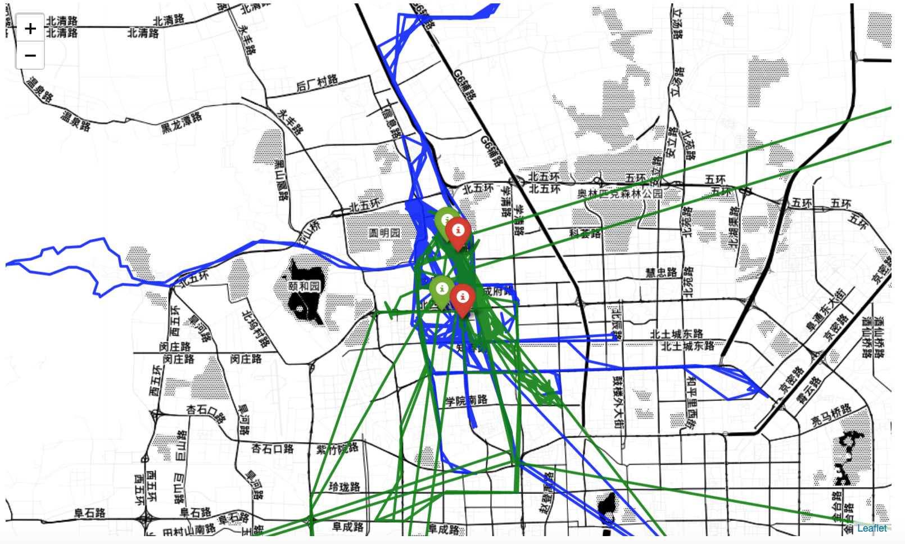
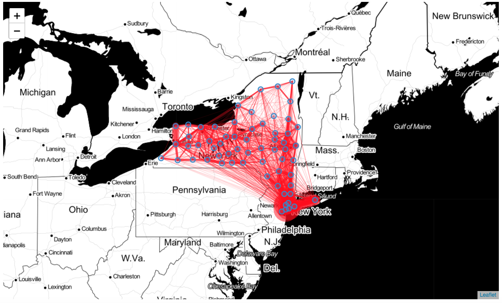
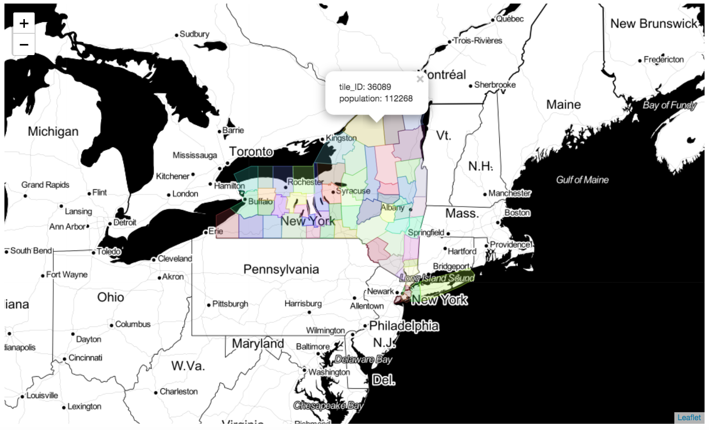

## Introduction
We study the description and usage of library scikit-mobility and summarize it.


# scikit-mobility

`scikit-mobility` is a library for **human mobility analysis** in Python. The library allows to:

- represent trajectories and mobility flows with proper data structures, `TrajDataFrame` and `FlowDataFrame`.
- manage and manipulate mobility data of various formats (call detail records, GPS data, data from social media, survey data, etc.);
- extract mobility metrics and patterns from data, both at individual and collective level (e.g., length of displacements, characteristic distance, origin-destination matrix, etc.)
- generate synthetic individual trajectories using standard mathematical models (random walk models, exploration and preferential return model, etc.)
- generate synthetic mobility flows using standard migration models (gravity model, radiation model, etc.)
- assess the privacy risk associated with a mobility data set

**keywords: human mobility, relative data structures, manage data, extract pattern, generate synthetic trajectories and flows, assess privacy risk.**


# Features of scikit-mobility

--A summary of `examples.ipynb`

## TrajDataFrame

represents a **point** of the trajectory, similar to pandas `DataFrame`

three mandatory field:

- `latitude` (type: float)
- `longitude` (type: float)
- `datetime` (type: date-time)

two optional columns : 
- `uid` (type: string) identifies the **object** associated with the point of the trajectory. 

即点属于哪个人

- `tid` specifies the identifier of the **trajectory** to which the point belongs to. 

即点属于哪条轨迹

Besides,  the user can add to a `TrajDataFrame` as many columns as they want.

Three ways to create a `TrajDataFrame` :

- from a list
- from a [pandas](https://pandas.pydata.org/) `DataFrame`
- from a file (in this way we can directly use the `Geolife` dataset)

With `folium`, we can plot the **points** on an interactive map.

```python
tdf.plot_trajectory()
```



## FlowDataFrame

describe a flow from an origin to a destination

three mandatory field:

- `origin` (type: string)

- `destination` (type: string)
- `flow` (type: integer)

Each `FlowDataFrame` is associated with a [geopandas](http://geopandas.org/) `GeoDataFrame`.

`GeoDataFrame` is a spatial tessellation(空间棋盘) and has two mandatory columns:

- `tile_ID` (type: integer) indicates the identifier of a location
- `geometry` indicates the **POLYGON** (or point) that describes the geometric shape of the location on a territory (e.g., a square, a voronoi shape(泰森多边形), the shape of a neighborhood). 

Besides,  the user can add to a `FlowDataFrame` as many columns as they want.

To create a  `FlowDataFrame` , we need to create  `GeoDataFrame` as its spatial tessellation(from file) first, then we can create `FlowDataFrame` from a file of flows.

With `folium`, we can plot the **flows** on an interactive map.

```python
fdf.plot_flows(flow_color='red')
```



Similarly, the **spatial tessellation** of a `FlowDataFrame` can be visualized.

```
fdf.plot_tessellation(popup_features=['tile_ID', 'population'])
```



## Trajectory preprocessing

four main preprocessing steps:

- ### noise filtering

e.g. filter points with too large speeds (default set to 500km/h)

```
ftdf = filtering.filter(tdf, max_speed_kmh=500.)
```

- ### stop detection+clustering

In scikit-mobility, the `stay_locations` function, contained in the `detection` module, finds the stay points visited by a moving object. 

```
stdf = detection.stay_locations(tdf, stop_radius_factor=0.5, minutes_for_a_stop=20.0, spatial_radius_km=0.2, leaving_time=True)
```

- ### trajectory compression

e.g. to merge all the points that are closer than 0.2km from each other

```
ctdf = compression.compress(tdf, spatial_radius_km=0.2)
```

## Measures

**Individual measures** summarize the mobility patterns of a single moving object.

**Collective measures** summarize mobility patterns of a population as a whole. 

Scikit-mobility provides a wide set of mobility measures, each implemented as a function that takes in input a `TrajDataFrame` and outputs a pandas `DataFrame`.

For example, we can compute the *radius of gyration*, the *jump lengths* and the *home locations* of a `TrajDataFrame`

**Radius of gyration**: The radius of gyration is a measure used to quantify the spatial dispersion or the spread of an individual's or object's movements over time. It provides an indication of **how far an individual typically moves from their center of activity**.

**Jump Lengths**: Jump lengths refer to the **distances traveled between consecutive locations** in a trajectory. A jump length is calculated by measuring the distance between two consecutive recorded points or check-ins.

**Home Locations**： The home location of an individual in trajectory data analysis is the place where the individual spends a significant amount of time or where they are most **frequently recorded** during their movements.

## Collective generative models

Collective generative models estimate spatial flows between a set of discrete locations.

根据区域（即tessellation，依据区域的距离和重要度）生成区域间的联合流

A collective generative model takes in input a spatial tessellation, i.e., a geopandas `GeoDataFrame` and produces a `FlowDataFrame` that contains the generated flows and the spatial tessellation. 

Two models

- the `Gravity` model

  two main methods:

  - `fit`, which calibrates the model's parameters using a `FlowDataFrame`
  - `generate`, which generates the flows on a given spatial tessellation

- the `Radiation` model

   only one method: 

  `generate`, given a spatial tessellation, the synthetic flows can be generated 

## Individual generative models

根据区域（即tessellation，依据区域的距离和重要度）生成个体轨迹数据

## Privacy

隐私问题：如果有匿名轨迹数据和一定的个人信息，能否把人和轨迹重新对应起来？

Privacy issues: If we have anonymous trajectory data and certain personal information, can we re-identify people with trajectories?

Scikit-mobility provides several attack models which can compute the risk probability.

## Downloading datasets

The `data` module provides some built-in datasets.

1) Download ready-to-use mobility data 
2) Load and transform the downloaded dataset into standard skmob structures
